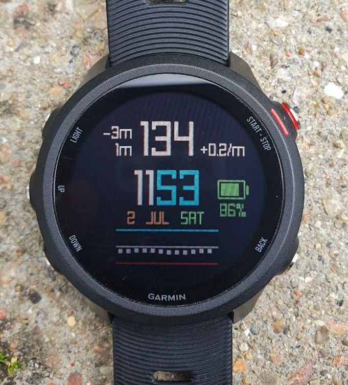
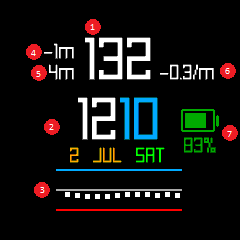

# Dextrack — a Garmin watch face with blood glucose monitoring

Dextrack is a Garmin watch face that shows last hour of blood glucose readings,
obtained from Dexcom share API.

**Please make sure to check the official Dexcom app before making bolus or
eating decisions!**

**Currently only Garmin Fenix 7s Pro is supported.**

## User interface



1. Last blood glucose reading obtained from Dexcom share.

   This shows a message (instead of a glucose level) when the last reading is
   more than 10 minutes old.

2. Current time and date

3. Last hour of glucose levels, plotted in a graph.

   - Blue line: 200 mg/dl
   - Red line: 80 mg/dl
   - Gray line: in the middle, 140 mg/dl

4. Indicates when the last reading was done, as reported by Dexcom. "-1m" in
   the screenshot means the shown bg level (132 mg/dl) was read by Dexcom 1
   minute ago.

   When this number (ignoring the minus sign) is less than 5, you don't need to
   check your phone or Dexcom device for a more recent reading, as Dexcom reads
   every 5 minutes.

   When this number (ignoring the minus sign) is larger than 5, then it's
   possible that your phone or Dexcom device will show a more recent reading.

5. Indicates when the next request to Dexcom share will be done, to read more
   recent numbers.

   An important limitation to be aware of is Garmin SDK requires at least 5
   minutes between HTTP requests. This means once we get the recent numbers
   from Dexcom share, we have to wait at least 5 minutes before requesting bg
   levels again.

   In most cases, the number you will see here will be 5 or less. However in
   some cases, to catch up with recent readings without too much delay,
   Dextrack waits more than 5 minutes before reading bg levels.

   For example, suppose we requested bg levels at 14:08, and the most recent
   reading was done at 14:05. We will show 3-minute-old bg level in (1). If we
   keep reading new bg levels every 5 minutes, we will always show 3-minute-old
   data.

   So in this case we wait 7 minutes instead 5. This means we will miss the
   reading at 14:10, but starting from 14:15 we will always show the most
   recent reading, with only a few seconds delay.

6. Blood glucose change rate, based on the last two readings.

   "-0.3/m" in the screenshot means that between the last two readings, the bg
   level was dropping 0.3 mg/dl per minute.

7. Watch battery level

When there is an error and during the login sequence, (1) shows a message on
what the device is doing, and a number in parens for when the next update will
be done.

## Installation

Dextrack is currently not available on Connect IQ Store, as it currently has no
way of configuring Dexcom username, password, and share server to use (based on
location). See development section below for details.

This will be fixed soon, and you will be able to install and configure it like
any other watch face in Connect IQ Store.

To install Dextrack on your watch, you first need to get your account id. This
is easily done by running this command after cloning the git repo: (requires
Python 3)

```
$ ./tools/get_account_id.py <your Dexcom username> <your Dexcom password>
```

This tool will print a line with 36 characters. This is your Dexcom account id.
Copy this, and create the file `source/Secrets.mc` with contents:

```
(:background)
const DEX_ACCOUNT_ID = "<your Dexcom account id>";

(:background)
const DEX_PASSWORD = "<your Dexcom password>";
```

Now you can compile the project as usual (see [Garmin's tutorial][1]), **using
SDK version 7.3.0**, and copy the generated file (the one with extension
`.prg`) to your watch (e.g. to `Primary/GARMIN/APPS`).

**If you are in the US**, update "shareous1" in `get_account_id.py` and
`source/Consts.mc` files to "share2".

[1]: https://developer.garmin.com/connect-iq/connect-iq-basics/getting-started/

## Development

I spent hours but failed to add a settings page to allow configuring Dexcom
username, password, and share server. Any help on this would be appreciated.

Once we have a settings page I will publish Dextrack on Connect IQ Store.

## Thanks

Dextrack would not be possible without xDrip developers' heroic effort to [hack
a Dexcom app and reverse engineer the Dexcom share API][2].

[2]: https://github.com/StephenBlackWasAlreadyTaken/xDrip/issues/182#issuecomment-1164859237

## Related software

- [xDrip][3]
- [Dex CGM app][4] (not open source) is what I used on my watch before writing
  Dextrack.

[3]: https://github.com/NightscoutFoundation/xDrip
[4]: https://apps.garmin.com/en-US/apps/0bf06c99-78f1-4b93-83d3-03f2317720b9
